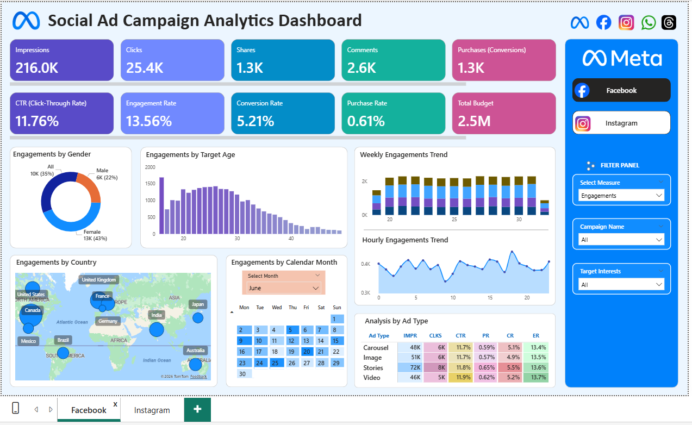
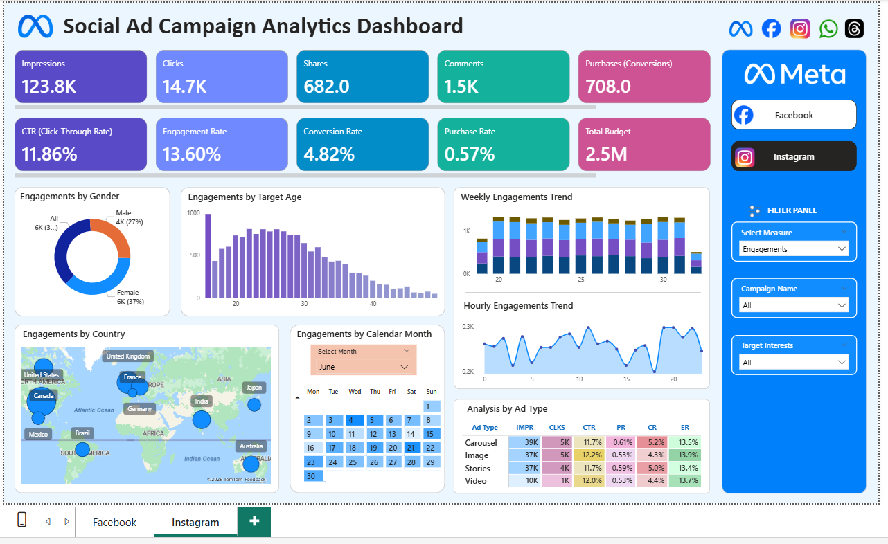
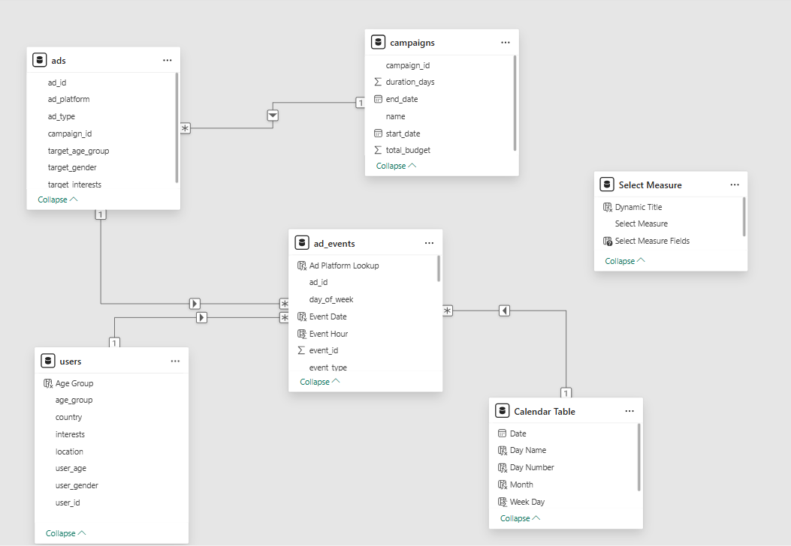

# Meta Ad Campaign Analytics — Power BI

**Stack:** Python · SQL · SQLite · Power BI · Power Query · DAX  
**Data scale:** 400,000 ad events · 50 campaigns · 200 ads · 9,841 users · May–August 2025

**[→ Live dashboard](https://app.powerbi.com/view?r=eyJrIjoiMmVhYTNkZTUtYmEzOS00YmYzLWI4MmMtZWI5YjJjZTg0MGI3IiwidCI6ImM2ZTU0OWIzLTVmNDUtNDAzMi1hYWU5LWQ0MjQ0ZGM1YjJjNCJ9)**

---

## Business Findings and Recommendations

A Meta ad campaign portfolio spanning Facebook and Instagram — 50 campaigns, $2.54M total budget, 400K events — was analysed to identify where budget was working and where it was being lost. The findings below are structured for the Performance Marketing, Media Planning, and Campaign Operations teams.

---

**Finding 1 — The ads are working. The post-click experience is not.**

CTR across both platforms is 11.79% — industry benchmark is 1–2%. The creative is doing its job at 6–10× the expected rate. The problem is what happens after the click:

```
339,812 impressions
    ↓ 11.79% CTR
 40,079 clicks
    ↓ 5.07% CVR
  2,031 purchases

~38,000 people clicked and left without buying.
```

A 1 percentage point improvement in Facebook CVR yields ~254 additional purchases worth **$317,009 at the blended CPA of $1,248.61 — from the same budget, without increasing spend.**

*Recommendation to Performance Marketing / Landing Page team:* the priority is not the ads — it is whatever happens after the click. Landing page, offer clarity, checkout flow. Campaign_32_Summer is the clearest case: 12.57% CTR but 0.93% CVR, meaning 107 clicks per purchase vs. 12 clicks per purchase for Campaign_14_Summer. The creative works. The destination does not. Audit it independently before the next campaign flight.

---

**Finding 2 — Facebook and Instagram respond to formats differently. A uniform strategy misallocates budget.**

**Facebook format performance:**

| Format | Impressions | CTR | Conv. Rate | Eng. Rate |
|---|---:|---:|---:|---:|
| Stories | 71,537 | 11.75% | **5.52%** | 13.61% |
| Video | 45,770 | **11.88%** | 5.22% | **13.74%** |
| Carousel | 47,752 | 11.73% | 5.05% | 13.44% |
| Image | 50,913 | 11.67% | 4.91% | 13.46% |

**Instagram format performance:**

| Format | Impressions | CTR | Conv. Rate | Eng. Rate |
|---|---:|---:|---:|---:|
| Carousel | 38,921 | 11.70% | **5.23%** | 13.46% |
| Stories | 37,395 | 11.70% | 5.00% | 13.44% |
| Image | 37,251 | **12.17%** | 4.35% | **13.88%** |
| Video | 10,273 | 11.96% | 4.39% | 13.74% |

On Facebook, Stories leads CVR (5.52%) and accounts for 33% of all impressions. On Instagram, Carousel leads CVR (5.23%) — not Stories. Image leads CTR on Instagram at 12.17% but is the worst converter (4.35%). The format logic that works on Facebook does not transfer to Instagram.

One caveat: CTR differences across all formats sit within a 0.74pp range. This is a synthetic dataset — CTR variance is too narrow to draw strong format conclusions on that metric alone. CVR gaps are larger and more meaningful for budget decisions.

*Recommendation to Media Planning / Creative Strategy team:*
- **Facebook:** increase Stories and Video allocation. Reduce Image — it ranks last on CVR.
- **Instagram:** lead with Carousel for conversion campaigns. Use Image for awareness objectives only. Do not import Facebook's "Stories first" logic to Instagram.

---

**Finding 3 — Germany underperforms. Canada and India outperform. Budget reallocation is straightforward.**

| Country | CTR | CVR | Purchases |
|---|---:|---:|---:|
| United States | 11.80% | 5.35% | 391 |
| Canada | 11.77% | **5.44%** | 130 |
| India | **12.03%** | 5.29% | 123 |
| United Kingdom | 11.43% | 4.94% | 177 |
| Germany | 11.83% | 4.86% | 98 |

Canada has the highest CVR (5.44%) and India the highest CTR (12.03%) of any market. Germany has the lowest CVR (4.86%) and second-lowest CTR. US drives volume — 391 purchases, not close — but Canada and India are the efficiency leaders.

*Recommendation to Campaign Operations / Geo-targeting team:* reallocate Germany's budget toward India and Canada. This produces more purchases from the same total spend without finding a new audience — the data supports the reallocation directly.

---

**Finding 4 — Ad targeting and actual audience gender are inverted.**

Female-targeted ads account for 43.4% of Facebook ad targeting allocation. Male-targeted: 21.7%. All-targeted: 34.8%.

Actual users engaging: **55.2% male, 34.7% female, 10.1% Other.**

The campaign portfolio is weighted toward female targeting, but the majority of people actually engaging are male. Either male users are engaging with female-targeted creative at unusually high rates — a targeting inefficiency — or the small male-targeted allocation is disproportionately efficient. Both interpretations point to the same action.

*Recommendation to Creative Strategy / Audience team:* add male-targeted variants to the three largest currently female-only campaigns. Run for two weeks and compare CVR. The inversion is 55.2% vs. 21.7% — that is not noise.

---

**Finding 5 — Dayparting optimisation is not supported by this data.**

| Time of day | Combined engagements |
|---|---:|
| Afternoon | 11,610 |
| Evening | 11,574 |
| Morning | 11,520 |
| Night | 11,440 |

170 engagements separate peak from trough — a 1.5% spread. Day-of-week is equally flat across all seven days (3.4% spread). Standard Meta guidance recommends afternoon/evening and Tuesday–Thursday scheduling. This dataset does not support that conclusion.

*Recommendation to Campaign Operations team:* do not allocate resources to scheduling optimisation based on this data. The signal is not there. Redirect that effort to the post-click experience (Finding 1).

---

## Dashboard Previews

### Facebook overview


### Instagram page


### Data model


The report uses a Power BI field parameter (6-metric switcher: Impressions, Clicks, Engagements, Comments, Purchases, Shares) so every chart on the page updates simultaneously on selection. Chart titles update dynamically via a DAX `SWITCH()` measure. All visuals are set to Filter mode — not Highlight — so cross-filtering returns exact numbers rather than dimmed proportions.

**[→ Open live dashboard](https://app.powerbi.com/view?r=eyJrIjoiMmVhYTNkZTUtYmEzOS00YmYzLWI4MmMtZWI5YjJjZTg0MGI3IiwidCI6ImM2ZTU0OWIzLTVmNDUtNDAzMi1hYWU5LWQ0MjQ0ZGM1YjJjNCJ9)**

---

## Why I Built This

I picked this dataset because ad funnel analysis is one of the most common analytical requests in marketing teams, and I wanted to build something I could walk through in an interview without it feeling contrived.

The Excel CSV-opening artifacts in the user data were the kind of problem I did not expect to find and could not have scripted. 289 user IDs were silently converted to scientific notation when someone opened the CSV in Excel — `50e00` becomes `5.00E+01` — and 117 more had leading zeros stripped. The event file kept the original strings, so the join broke on 5% of all rows without any error message. Catching that before building any visuals, tracing it to the exact root cause, and documenting why 20,046 events have no user match is the kind of data quality work that matters in a real analytics role.

The dayparting finding was also deliberate. The honest answer was that the data did not support any scheduling recommendation — uniform random timestamps produce no hourly signal. Saying so clearly, with the numbers, is more useful to a marketing team than manufacturing a pattern that is not there.

---

## SQL Analysis Layer

The raw CSVs are loaded into SQLite via `data/load_to_sqlite.py`, enabling the five queries in `data/analysis.sql` to cross-validate every dashboard finding independently of Power BI.

| Query | Business question | Key SQL techniques |
|---|---|---|
| Q1 — Full funnel by platform | Validates the headline CTR, CVR, and engagement rate KPIs | CTE, `CASE WHEN`, `NULLIF`, multi-metric aggregation |
| Q2 — Format CVR ranked per platform | Surfaces the Stories vs Carousel insight by platform | `RANK() OVER (PARTITION BY)`, multi-table `JOIN` |
| Q3 — Campaign performance ranked | Identifies CVR outliers — Campaign_32_Summer should rank worst | `RANK() OVER`, CPA calculation, `HAVING` |
| Q4 — Geo efficiency by country | Validates the Germany vs Canada/India CVR gap | `JOIN`, `HAVING`, `RANK() OVER` |
| Q5 — Targeting vs actual gender | Quantifies the targeting inversion using `UNION ALL` | `UNION ALL`, window `SUM OVER`, `COUNT DISTINCT` |

To run:

```bash
# Load raw CSVs into SQLite
python data/load_to_sqlite.py

# Run all queries
sqlite3 data/ad_analysis.db < data/analysis.sql
```

Q1 output cross-checks directly against the dashboard: Facebook CTR 11.76%, CVR 5.21% — Instagram CTR 11.86%, CVR 4.82%.

---

## Data Quality Issues Found

Three issues caught before building any visuals — all documented and accounted for in the analysis:

**1. User join gap (5.01%)** — 20,046 event rows have no matching user. Root cause: 406 corrupted user IDs in `users.csv` from two Excel CSV-opening artifacts: 289 IDs converted to scientific notation (`50e00` → `5.00E+01`) and 117 IDs with leading zeros stripped (`00062` → `62`). These events still count in all KPI totals — they are excluded only from demographic breakdowns.

**2. Campaign window violations (56.4%)** — 225,406 events fall outside their linked campaign's start/end dates. Too large for a timezone artifact — campaign dates are not reliable event boundaries in this dataset and are not used as analysis filters.

**3. Budget fanout** — `total_budget` is stored at campaign grain. Joining it to event grain and summing inflates the figure from $2.54M to $20.47B. All budget measures pull directly from the campaigns table.

The Python audit script at [`data/audit.py`](data/audit.py) reproduces all of these checks against the raw CSVs:

```bash
pip install pandas
python data/audit.py
```

Expected runtime: under 30 seconds on the full 400K-row dataset.

---

## Data Model

Four tables in a snowflake schema:

```
campaigns ──< ads ──< ad_events >── users
                           │
                      calendar table (DAX)
```

- `campaigns → ads` on `campaign_id` (1:many)
- `ads → ad_events` on `ad_id` (1:many)
- `users → ad_events` on `user_id` (1:many, 94.99% match rate)
- Calendar table built in DAX via `CALENDARAUTO()` — required for time intelligence functions to work correctly

**Key DAX measures:**

```dax
CTR              = DIVIDE([Clicks], [Impressions], 0)
Conversion Rate  = DIVIDE([Purchases], [Clicks], 0)
Engagement Rate  = DIVIDE([Engagements], [Impressions], 0)
Engagements      = [Clicks] + [Comments] + [Shares]
Total Budget     = SUM(campaigns[total_budget])
```

Likes are tracked in the source data (FB: 7,505 / IG: 4,508) but excluded from Engagements. A like is a one-tap low-effort interaction — Clicks, Comments, and Shares represent more deliberate engagement and make the metric easier to explain consistently to non-technical stakeholders.

---

## Project Structure

```
social-ad-campaign-analytics-powerbi/
├── README.md
├── .gitignore
├── meta_ad_performance.pbix          ← Power BI working file
├── data/
│   ├── audit.py                      ← Python data quality checks
│   ├── analysis.sql                  ← SQL: funnel, format, campaign, geo, gender queries
│   ├── load_to_sqlite.py             ← loads raw CSVs into SQLite for SQL analysis
│   ├── raw/                          ← full source CSVs (400K events)
│   └── sample/                       ← 2K-row clean subset
├── docs/
│   ├── findings.md                   ← full findings with all tables
│   ├── data_audit.md                 ← data quality documentation
│   ├── data_dictionary.md            ← field reference for all tables
│   ├── methodology.md                ← DAX decisions and model logic
│   └── dashboard_walkthrough.md      ← visual-by-visual breakdown
├── images/
│   ├── dashboard_overview.png
│   ├── dashboard_instagram.png
│   └── data_model.png
└── dashboard/
    └── README.md                     ← Power BI setup instructions
```